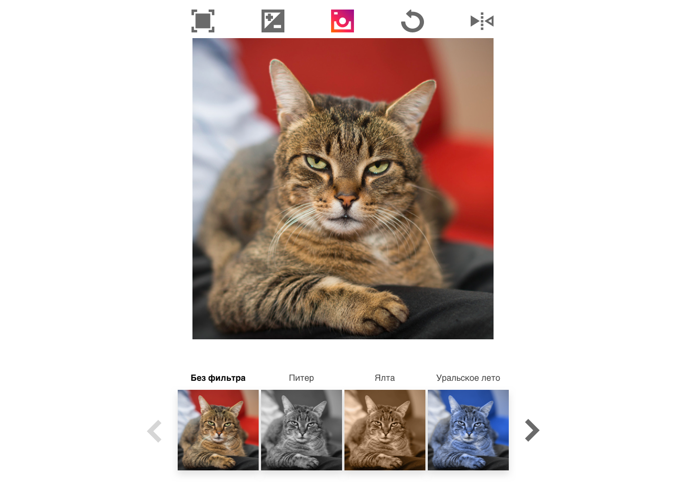
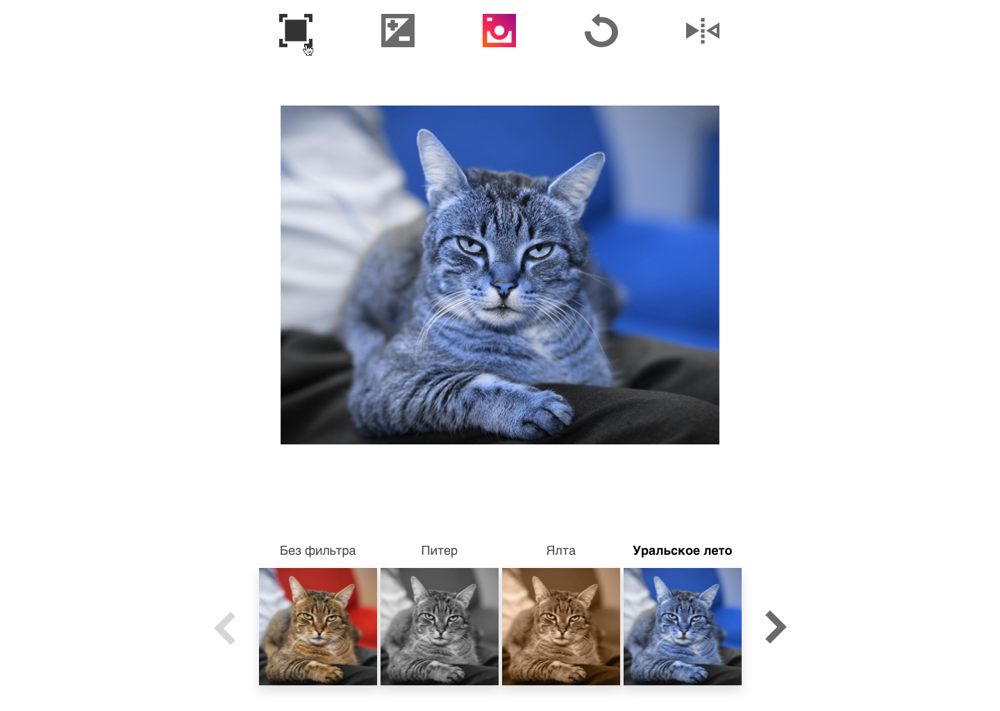

# Задача №4 "Котограм"
​
## Как отправить решение:
1. Склонируйте репозиторий ([тут](pull.md) есть описание как это сделать).
2. Напишите код в файлах ```catgram/src/index.css``` ```catgram/src/index.html```
3. Отправьте Pull Request. В качестве commit message пишите что изменилось.

## Основное задание
​
​
### ⚠️ Задание необходимо решить без использования JS
​
Благодаря вашей героической помощи с Мурмаркетом все котики нашли себе новых хозяев! Теперь бабуленька коротает долгие зимние вечера, вздыхая и разглядывая кошачьи фоточки. Ей было бы гораздо веселее, если бы их можно было не только смотреть, но и редактировать!

Давайте сделаем для нее Котограм, красивый и бесполезный. Красивый, потому что все котики прекрасны, а фильтры позволяют раскрыть индивидуальность каждого. Бесполезный, потому результат нельзя никуда сохранить, но разве это важно?

Вот такой:






Необходимо сверстать этот макет, соблюдая следующие условия:

- Страница находится посередине экрана и имеет фиксированную ширину
- Иконки контролов нужно реализовать с использованием svg-спрайта, его вы должны сами собрать из иконок в папке icons. Иконки должны располагаться в верхней строке, как нарисовано на макете.
- Фоточка котика (любого, можно даже вашего!) должна быть подходящего формата. Главное – не забыть об оптимизации
- Нужно реализовать следующие контролы редактирования изображения, при редактировании нужно реализовать анимации:
    - вмещаемость (вписано в квадрат/показано целиком)
    - масштабирование (каждое нажатие циклически изменяет масштаб: 1 - x1 - ... xn - 1 ...)
    - просмотр исходного изображения при нажатии на логотип
    - поворот (циклически, аналогично масштабированию)
    - отражение по горизонтали
- Нужно реализовать фильтры с макета. Фильтры должны применяться с анимацией. Название активного фильтра выделено полужирным. Фильтры располагаются в галерее со стрелками для пролистывания (если все фильтры вмещаются на одном экране - стрелки неактивны) под изображением.
Не забудьте сделать красивый градиент для логотипа :)
Подсказка: для циклического переключателя отлично подходит сочетание радиокнопок и z-index ;)

## Дополнительное задание
Придумайте и реализуйте еще несколько (хотя бы 2) фильтров для Котограма и добавьте их в галерею-карусель, дополнив ее поведение следующими пунктами:

- Фильтры листаются вправо и влево по клику на соответствующие иконки
- Одновременно видно не более четырех фильтров
- Если листать дальше некуда, иконка с соответствующей стороны становится неактивной
​

## Рекомендации к написанию кода:
⚠️Эти пункты учитываются при проверке⚠️

- Соблюдайте семантику - важно выработать привычку называть все своими именами
- HTML-разметка и css должны быть валидными - проверьте на сайте W3C [html](https://validator.w3.org/), [css](https://jigsaw.w3.org/css-validator/)
- В CSS не используйте универсальные селекторы и по идентификаторам, если в этом нет необходимости
- В CSS не используются селекторы элементов (кроме случаев, когда это селектор охватывает 1-2 элемента, например, body или html). Предпочтительны селекторы классов
- Старайтесь не дублировать название одного и того же класса, а селекторы с одинаковым набором правил группируются в один через запятую
- Не используйте !important и инлайн-стили, если в этом нет необходимости, а если есть причины - опишите в комментариях в коде
- Решение должно корректно отображаться и работать в последних версиях современных браузеров (Chrome, Firefox, Safari, YandexBrowser)
- Пишите комментарии в коде, почему приходится нарушать рекомендации

